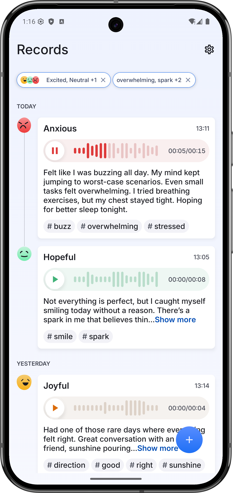

# Records App

**Records App** is a modern Android application designed for effortless voice recording, management, and enrichment. Built entirely with Kotlin and leveraging the latest Android Jetpack libraries, it offers a reactive user experience with a clean, MVI architecture guided by SOLID principles.

## 🌟 Features

*   **🎙️ High-Quality Voice Recording:**
    *   Standard recording mode with pause/resume/seek functionality.
    *   "Quick Capture" mode via a long-press on the record button for spontaneous moments.
*   **▶️ Audio Playback:**
    *   In-app playback of recordings.
    *   Seek functionality to navigate through audio.
    *   Visualisation of audio amplitudes during playback.
*   **💾 Local Storage & Management:**
    *   Securely saves recordings locally on the device.
    *   Option to add titles, notes, moods, and topics to each recording for better organization.
*   **🎨 Mood & Topic Tagging:**
    *   Assign a mood (e.g., Happy, Sad, Neutral) to each recording.
    *   Add custom topics to categorize and filter recordings.
*   **🔍 Filtering & Searching:**
    *   Filter recordings by selected moods and topics.
*   **⚙️ User Settings:**
    *   Set default mood and topics for new recordings.
*   **📱 Modern UI/UX:**
    *   Built with Jetpack Compose for a beautiful, reactive, and declarative UI.
    *   Intuitive navigation and user flows.
*   **🔗 Deep Linking:**
    *   Supports a custom deep link to potentially initiate record creation from external sources (widget).

## 🛠️ Tech Stack & Architecture

*   **Language:** [Kotlin](https://kotlinlang.org/) (100%)
*   **UI Toolkit:** [Jetpack Compose](https://developer.android.com/jetpack/compose) - for a fully declarative UI.
*   **Architecture:** Model-View-Intent (MVI)
    *   Adherence to **SOLID** principles for maintainable and testable code.
*   **Asynchronous Programming:** [Kotlin Coroutines](https://kotlinlang.org/docs/coroutines-overview.html) & [Flow](https://kotlinlang.org/docs/flow.html) - for managing background tasks, asynchronous data streams, and ensuring a responsive UI.
*   **Dependency Injection:** [Koin](https://insert-koin.io/) - for clear and manageable dependencies.
*   **Navigation:** [Jetpack Navigation Compose](https://developer.android.com/jetpack/compose/navigation) - for navigating between screens.
*   **Database:** [Room Persistence Library](https://developer.android.com/training/data-storage/room) - for local storage of recording metadata, moods, and topics.
*   **Data Storage:**
    *   [Jetpack DataStore (Preferences)](https://developer.android.com/topic/libraries/architecture/datastore) - for user settings.
    *   Internal App Storage - for storing audio files.
*   **Audio Handling:** Android `MediaRecorder` & `MediaPlayer` (via custom wrapper classes like `AndroidVoiceRecorder` and `AndroidAudioPlayer`).
*   **Jetpack Libraries:**
    *   ViewModel
    *   Lifecycle Components (including `collectAsStateWithLifecycle`)
    *   `SavedStateHandle` for state restoration.
*   **Logging:** [Timber](https://github.com/JakeWharton/timber)
*   **Permissions:** Android Runtime Permissions for `RECORD_AUDIO`.

## 📸 Screenshots

